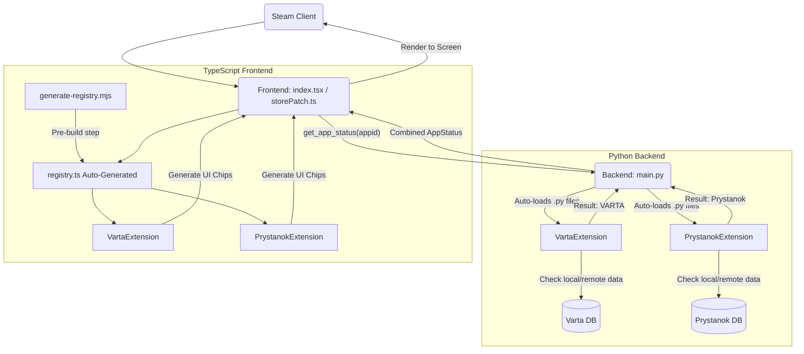

# Додавання нових модулів

Архітектура плагіна побудована навколо концепції **модулів**. Кожен модуль — це незалежний набір правил, бейджів, іконок та налаштувань. Це дозволяє легко додавати нові перевірки та інтеграції (наприклад, VARTA для розробників, Prystanok для локалізаторів, тощо) без зміни основного ядра плагіна.

The plugin architecture is built around the concept of **modules (extensions)**. Each module is an independent set of rules, badges, icons, and settings. This makes it easy to add new checks and integrations without altering the core of the plugin.

---

## Архітектура



---
## Структура модуля

Модуль складається з двох частин:
1. **Python-бекенд** (`py_modules/extensions/`): Відповідає за завантаження бази даних, збереження в кеш та перевірку, чи має гра відповідний статус.
2. **TypeScript-фронтенд** (`src/extensions/`): Відповідає за відмальовування бейджів (картинок/тексту) в інтерфейсі Steam (картка гри, магазин) та рендеринг меню налаштувань.

---

## 1. Python-частина

Створіть файл вашого модуля (наприклад, `my_module.py`) у папці `py_modules/extensions/`.
Він повинен успадковувати базовий клас `BaseExtension`.

```python
# py_modules/extensions/my_module.py
import os
from .base import BaseExtension

class MyModuleExtension(BaseExtension):
    def __init__(self, data_dir, logger):
        # Вкажіть шлях до кешу для вашого модуля
        cache_path = os.path.join(data_dir, "my_module_cache.json")
        super().__init__(cache_path, logger)
        
        # Наприклад, ваша база
        self._database = {"status1": ["123", "456"]}

    def check_app(self, appid, name, developer, publisher):
        # Логіка перевірки гри. Повинна повертати словник.
        # Якщо гра не знайдена, поверніть {"type": None}
        if appid in self._database["status1"]:
            return {"type": "status1"}
        return {"type": None}
        
    async def refresh_database(self):
        # Логіка оновлення бази (наприклад, завантаження з мережі)
        pass
```

**Це все для бекенду!** Плагін автоматично просканує папку `py_modules/extensions/`, знайде ваш клас і підключить його до ядра. Жодних змін у `main.py` робити не потрібно.

---

## 2. TypeScript-частина

Створіть папку вашого модуля в `src/extensions/` (наприклад, `src/extensions/my_module/`) та створіть файл `index.tsx`.
Він повинен реалізовувати інтерфейс `Extension`.

```tsx
// src/extensions/my_module/index.tsx
import { Extension } from "../base";
import { PluginSettings } from "../../types";

const MyModuleExtension: Extension = {
  id: "my_module",
  name: "My Custom Module",
  
  // Компонент меню налаштувань (використовуйте компоненти з @decky/ui)
  SettingsComponent: ({ settings, setSettings }) => {
    return (
      <div>Налаштування мого модуля</div>
    );
  },

  // Отримання бейджа для сторінки гри (Game Page)
  getBadgePayload: (status, settings) => {
    if (status.type === "status1") {
      return {
        type: "status1",
        label: "Знайдено!",
        background: "rgba(0, 100, 200, 0.8)",
        isIcon: false, // true, якщо хочете відрендерити іконку
      };
    }
    return null;
  },

  // Отримання бейджа для Steam Store
  getStoreBadgePayload: (status, settings) => {
    if (status.type === "status1") {
      return {
        appid: status.appid,
        type: "status1",
        label: "Знайдено у MyModule",
        background: "rgba(0, 100, 200, 0.85)",
        border: "rgba(100, 200, 255, 0.65)",
        shadow: "rgba(0, 0, 0, 0.5)",
        isIcon: false,
      };
    }
    return null;
  },
};

export default MyModuleExtension;
```

**Це все для фронтенду!** Наш пре-білд скрипт автоматично знайде вашу папку під час `npm run build` і підключить її до інтерфейсу. Жодних `registry.ts` правити не треба!

---

## 3. Як відправити свій модуль (Процес контриб'юції)

Архітектура плагіна передбачає автоматичне виявлення та інтеграцію модулів під час збірки. Розробникам не потрібно вносити зміни до ядра системи. Для додавання власного модуля дотримуйтесь наступного алгоритму:

1. **Створіть форк репозиторію**
   Перейдіть на сторінку репозиторію VARTA на GitHub та натисніть кнопку "Fork", щоб створити копію у своєму акаунті.

2. **Створіть файли модуля у вашій гілці**
   Створіть гілку для вашої фічі та додайте необхідні файли:
   - Файл бекенду: `py_modules/extensions/your_module.py`
   - Папку фронтенду: `src/extensions/your_module/` із файлом `index.tsx` (в якому повинен бути default export).

3. **Протестуйте локально**
   Запустіть збірку `npm run build` у вашому локальному середовищі. Переконайтеся, що не виникає помилок `npm run typecheck`, і що плагін працює коректно на вашому Steam Deck.

4. **Створіть Pull Request**
   Завантажте зміни у свій форк на GitHub. Перейдіть у вкладку "Pull requests" оригінального репозиторію та створіть новий запит. Адміністратори розглянуть ваш код та після схвалення додадуть його в загальну збірку.
